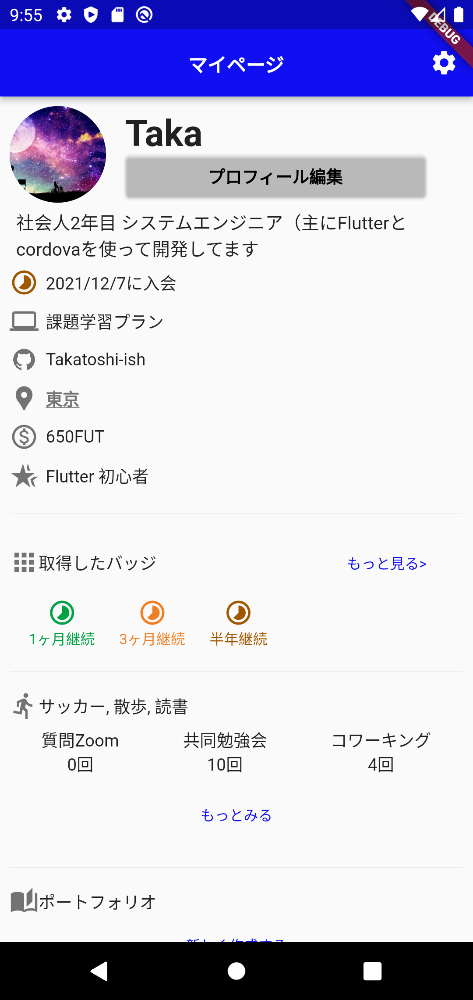

# flutter_selfintroduction

## Flutterの教科書 実践課題
### Widgetの基礎『Twitter UI』

A. 自己紹介ページを作ってみよう
ここまで学んだことを活かして自己紹介ページを作ってみましょう。

B. お気に入りの画面をトレースしてみよう
普段使っているアプリであなたが「かっこいいな、美しいな」と感じる画面をトレースしてみましょう。

上記A・Bの課題をまとめて行いました。

